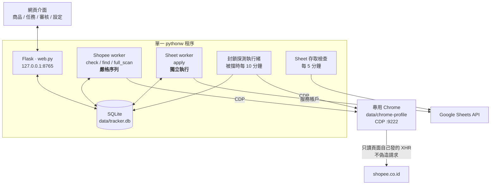
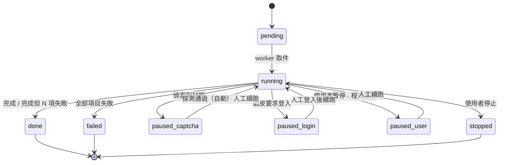
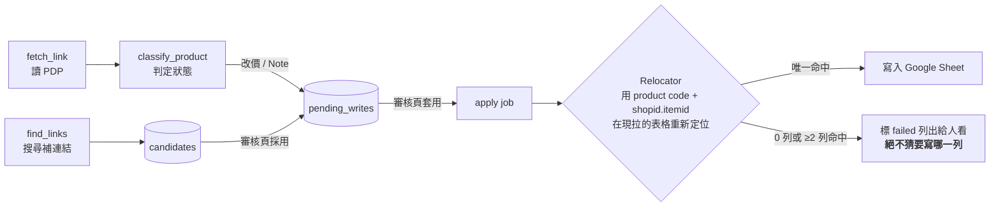
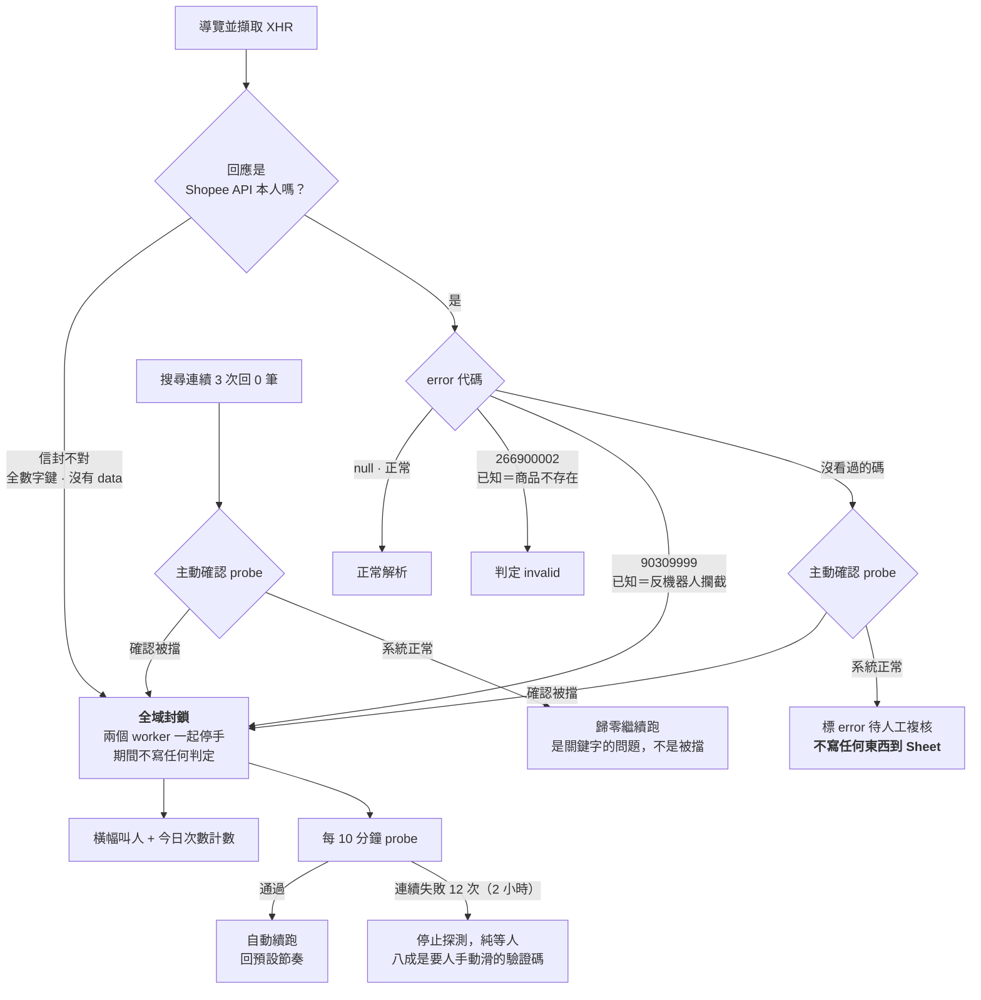

# Indo Shopee 連結及基準成本管理系統

依 [SPEC.md](SPEC.md) 實作：本地網頁介面管理 Google Sheet「purchase link」分頁的採購連結——驗證連結（invalid / sold out / unlisted / high cost）、回填最新 IDR 價格、依基準成本判斷高價，並在有效連結不足時自動到印尼蝦皮搜尋補連結。

## 啟動

雙擊 **`app.pyw`**（無 cmd 視窗）→ 自動開啟瀏覽器 `http://127.0.0.1:8765`。
除錯時改用終端機執行 `python app.pyw` 可看即時 log（log 檔在 `data\logs\app.log`）。

---

## 架構

### 程序與執行緒

單一 `pythonw` 程序，內含 Flask、SQLite 與四個背景執行緒。**Shopee 任務嚴格序列**（共用同一個 Chrome 工作分頁與節奏控制），**寫表任務獨立執行**（只碰 Google Sheets API，沒有共用資源，不必排在幾十小時的掃描後面）。



### 任務狀態

每個 job_item 各自是一個交易，所以任務可續跑：程式重啟後未完成的任務轉 `paused_user`，按「續跑」會從第一個仍是 pending 的項目接續。



任務結束時分三級：**零失敗**＝「完成」、**部分失敗**＝「完成（N 項失敗）」、**全部失敗**＝`failed` 並帶第一個錯誤訊息。跑完 97.3% 的大批次不該跟「完全沒做到事」長得一樣。失敗項可在任務詳情頁按「重跑失敗項」打回 pending。

### 寫入管線

所有 Sheet 變更都先進 `pending_writes` 佇列，寫入前**重新拉表格定位列**，絕不按舊列號硬寫。



---

## 反機器人防護

蝦皮被擋時**不會說「你被擋了」**，它回的東西跟正常業務結果長得幾乎一樣。2026-08-03 的事故就是這樣來的：攔截回應被當成「商品不存在」，好連結被標失效並排隊寫回客戶的表，程式則以每 2.5 秒一次的節奏連撞 2.5 小時。

因此預設立場是 **「看不懂的回應不下任何業務判定」**——白名單，不是黑名單。



幾個關鍵設計：

- **主動確認（probe）一魚三吃**：判定被擋、暫停後定期探測、恢復認定，三處共用同一支邏輯，不會出現「這邊說被擋、那邊說沒被擋」。測試對象從 DB 現挑一條最近確認還活著的連結，不寫死網址（寫死的商品總有一天會下架，之後探測會永遠失敗）。
- **計數器只是觸發器**：搜尋回 0 筆有太多無辜成因（關鍵字爛、位置篩選太窄、商品絕版），所以連續 3 次只負責喊「該檢查了」，判定交給 probe。實測健康期 2415 次搜尋最長連續 0 筆只有 1 次，被擋時則是連續數百次。
- **驗證碼會長在商品網址上**（見 `image5.png`），網址完全正常、只有頁面內容是驗證框，所以偵測不能只看 href，必須比對 DOM。
- **被擋＝全系統停手**，`apply` 也不例外。它雖然不碰蝦皮，但封鎖期間產生的判定不可信，讓它繼續寫表等於把污染送出門。

### 節奏

| 設定 | 值 | 理由 |
|---|---|---|
| 每次操作等待 | 3–8 秒 | 實測 22 小時 5,450 次導覽零驗證碼的那一組。1–3 秒那組把導覽速率拉到約 470 次/小時，連續跑 29.6 小時後被擋 |
| 每 25 次長暫停 | 60 秒 | 同上 |
| 連續工作 4 小時 | 強制休息 10 分鐘 | 事故的兩個變因（速率、連續時長）裡，**連續時長是從未被驗證過的那一個**——舊節奏只跑過 22 小時。放慢節奏不能取代休息 |

全表掃描（約 5,800 個項目）在此節奏下預估 **50–60 小時**。

---

## 首次設定（一次性）

### 1. 安裝依賴

用系統 Python，**不要建 venv**——Smart App Control 會封鎖 venv 內的原生 DLL：

```
pip install --user openpyxl
pip install google-auth==2.29.0
```

其餘 Flask / gspread / Pillow / websocket-client 本機已有。`google-auth` 必須釘 2.29.0，新版會 import 被 Smart App Control 封鎖的 cryptography DLL。

### 2. Google 授權——用服務帳戶（建議）

服務帳戶是一個獨立的 Google 身分：**授權不會過期、不需要瀏覽器、沒有「未驗證應用程式」警告**。對一個無人值守、單趟跑幾十小時的批次工具，這是唯一合理的選擇。

1. [Google Cloud Console](https://console.cloud.google.com/) → 建立專案 →「API 和服務」→ 啟用 **Google Sheets API**
2. 「憑證」→「+ 建立憑證」→ **服務帳戶** → 建立後進入該帳戶 →「金鑰」→「新增金鑰」→ JSON → 下載存成 `data\service_account.json`
3. **把試算表分享給服務帳戶的信箱**（JSON 裡的 `client_email`，形如 `xxx@專案名.iam.gserviceaccount.com`），權限選**編輯者**

設定頁應顯示「✅ 已授權且可存取試算表（服務帳戶）」。忘了第 3 步的話，狀態列會直接告訴你要分享給哪個信箱。

> **舊的使用者 OAuth 模式仍可用**（沒有 `service_account.json` 時自動退回），憑證放 `data\client_secret.json`。但請注意：**OAuth 同意畫面停在「測試中」發布狀態時，Google 發出的授權每 7 天就會失效一次**——2026-08-03 的 apply 任務就是這樣失敗的。除非你把應用發布到 production，否則不建議用。

### 3. Chrome 登入蝦皮

設定頁按「啟動 Chrome」，工具會用一個**獨立的瀏覽器設定檔**（存在 `data\chrome-profile`，跟你平常用的 Chrome 完全分開——不同的登入狀態、書籤、擴充功能、程序，兩邊可以同時開著互不干擾）啟動新視窗並開啟除錯埠。

1. 視窗預設停在 shopee.co.id 首頁、全新未登入 → 照平常方式登入（帳密 + OTP），只需要做這一次
2. 登入狀態存在 `data\chrome-profile`，**下次啟動不用再登入**；就算把視窗整個關掉，工具下次要用時會自動用同一個設定檔重新啟動
3. 執行任務時視窗可以縮到背景。只有遇到**驗證碼**或**登入過期**時，工具才會把它拉到前景並在介面跳紅色橫幅
4. 這個設定檔請保持乾淨，**不要裝廣告攔截器等擴充功能**——它們會干擾工具攔截頁面請求
5. 想強制重新登入就把 `data\chrome-profile` 整個刪掉，再按一次「啟動 Chrome」

### 4. 錄製位置篩選參數

在該 Chrome 搜尋任意商品 → 設定頁按「開始錄製」→ 手動套用 Shipped From 篩選（More → Others → 勾三個 Tangerang + 五個 Jakarta → CONFIRM）→ 工具自動記下參數。

### 5. 拉取資料

設定頁按「從 Google Sheet 拉取」（離線測試可用「從本地 xlsx 匯入」）。

---

## 日常操作

- **商品頁**：篩選「有效連結 < 3」→ 勾選 →「檢查勾選商品」或「為勾選商品找連結」；明細頁可編輯基準成本與 X% 門檻（存本地，不動 Sheet 結構）。
- **任務頁**：看進度、暫停/續跑/停止、重跑失敗項。狀態列顯示的是**實際在執行的**任務加佇列長度，不是 id 最大的那一個。
- **找連結的完整流程**：按「找連結」後，候選只會進**審核頁**，不會自動寫進 Sheet。要補進表格必須在審核頁**採用**候選（產生「插入新列」待寫入），再按**套用**才真正插到 Sheet。所以「找連結」跑完 Sheet 沒變是正常的。若第一頁找不到足夠相似商品，會標「需人工設定關鍵字」。
- **審核頁**：dry-run 模式（預設開）下所有變更都停在這裡，確認後按「套用」才寫入。套用失敗的項目會留在列表上並附原因，修好後可重新勾選套用。
- **前端自動重整**：商品頁/明細頁/審核頁在追蹤的任務結束後自動重載一次。
- **Note 防蓋**：工具只寫/清 `invalid`、`sold out`、`unlisted`、`high cost`、`link error` 這幾種機器標記；I 欄的人工備註（如「6/27 Store is Holiday」）絕不覆寫，會標成 note conflict 供人處理。
- **表上有重複列時會刻意失敗**：同一商品碼下若有兩列指向同一個蝦皮連結，`Relocator` 無法判定該寫哪一列，該筆會標 failed 並列出來——不猜。刪掉重複列、重新拉取後再套用即可。

---

## 驗證流程建議（首次上線 / 大改之後）

1. **離線測試**（不碰網路）：`python tests/test_pipeline.py`、`python tests/test_sync.py`
2. **小批次真跑**：`dry_run` 維持開啟，挑約 20 個商品跑 check + find，確認沒有無故暫停、沒有大量 `error`
3. **全表掃描**：`dry_run` 維持開啟跑完 → 人工檢查 `pending_writes` 內容 → 再關 `dry_run` 執行 apply

---

## 離線測試

```
python -m tracker.cli smoke                  # 模組 import 冒煙測試（Smart App Control 檢查）
python -m tracker.cli import-xlsx            # 從本地 xlsx 建鏡像並列印統計
python -m tracker.cli keyword "KBT105 #14"   # 預覽搜尋關鍵字
python tests/test_pipeline.py                # 假 driver 跑完整 check/find 管線 + 封鎖偵測 + 排程
python tests/test_sync.py                    # 表格同步 / 幻影列收斂
```

封鎖偵測的測試素材直接取自 `data/raw/` 裡真正被擋時收到的 payload，不是編造的。

---

## 模組

| 檔案 | 職責 |
|---|---|
| `tracker/web.py` | Flask 路由與頁面 |
| `tracker/jobs.py` | 兩個 worker、全域封鎖旗標、探測執行緒、任務狀態 |
| `tracker/shopee.py` | CDP 驅動蝦皮、封鎖偵測與 probe、節奏控制、回應解析 |
| `tracker/checker.py` | fetch_link / classify_product，狀態判定與寫入排隊 |
| `tracker/finder.py` | 關鍵字建構、分層搜尋、圖片比對、候選提案 |
| `tracker/sheets.py` | 表格拉取/鏡射、`Relocator` 定位、寫入執行、Google 授權 |
| `tracker/cdp.py` | 極簡 Chrome DevTools Protocol 客戶端 |
| `tracker/db.py` | SQLite schema 與遷移 |

各檔案開頭的 docstring 有更細的說明與設計理由。
